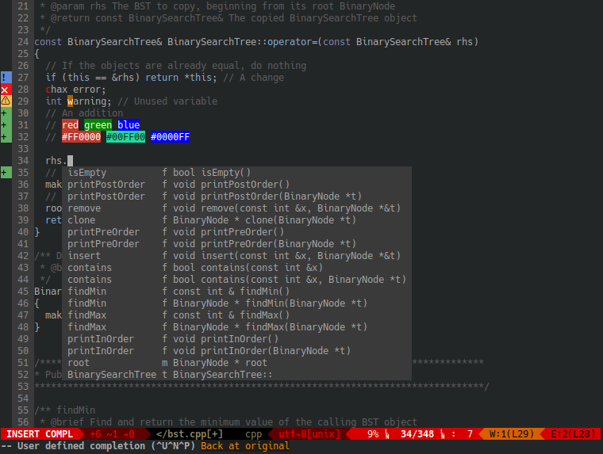

## Dotfiles

Dotfiles configurations for headless Kubuntu linux environments. Be sure to
clone recursively if you want to grab updated plugins / submodules included. For
example, using Pathogen with Vim to manage plugins requires that the plugin to
be installed are cloned to the `~/.vim/bundle/` directory. Cloning recursively
allows git to clone these same nested repositories/submodules within this
directory so Pathogen can handle running the Vim plugins.

Once installed, editing source code in vim supports features displayed in the
screenshot below



### Install

Installation instructions

```bash
git clone --recursive https://github.com/shaunrd0/dot
cd dot/
./setup.sh
mv ~/.bashrc ~/.bashrc.backup
stow . -t ~
```

To uninstall

```bash
stow -D . -t ~
mv ~/.bashrc.backup ~/.bashrc
```

If you have files other than `~/.bashrc` that conflict with these
configurations,
be sure to back them up so you can restore to your original state. If you do not
provide the `-t` flag to stow, the files will be symlinked within the parent
of your current directory.

### Docker

You can run these dotfiles in a docker container -

```bash
git clone git@github.com:shaunrd0/dot.git
cd dot
docker build -t dot .
docker run -it dot bash
```

Note that some features may not work properly in the container, like system
clipboard integration with vim or certain font icons used in themes. Still, the
base configurations work, and using the container as a clean environment is
useful for testing things such as installation instructions for a personal
project.

### Configurations

#### Utilities

| Tool                 | Description                                                                                                        | Repository                                                                                               |
|----------------------|--------------------------------------------------------------------------------------------------------------------|----------------------------------------------------------------------------------------------------------|
| ranger               | Console-based file manager with Vim-like keybindings, previews, and customizable commands.                         | [https://github.com/ranger/ranger](https://github.com/ranger/ranger)                                     |
| ble.sh               | Advanced Bash line editor providing syntax highlighting, autosuggestions, and improved interactive shell behavior. | [https://github.com/akinomyoga/ble.sh](https://github.com/akinomyoga/ble.sh)                             |
| GNU Stow             | Manages dotfiles using symlinks. Repository structure is organized for per-package Stow deployment.                | [https://www.gnu.org/software/stow/](https://www.gnu.org/software/stow/)                                 |
| `.stow-local-ignore` | Stow configuration file that excludes specific files or patterns from being symlinked during deployment.           | [https://www.gnu.org/software/stow/manual/stow.html](https://www.gnu.org/software/stow/manual/stow.html) |
| `setup.sh`           | Bootstrap script that automates symlink setup and environment initialization.                                      | (Repository-local script)                                                                                |

#### Tmux

| Plugin              | Description                                                              | Repository                                                                                       |
|---------------------|--------------------------------------------------------------------------|--------------------------------------------------------------------------------------------------|
| tmux plugin manager | Manages tmux plugins directly from GitHub.                               | [https://github.com/tmux-plugins/tpm](https://github.com/tmux-plugins/tpm)                       |
| tmux-resurrect      | Saves and restores tmux sessions, panes, and layouts between restarts.   | [https://github.com/tmux-plugins/tmux-resurrect](https://github.com/tmux-plugins/tmux-resurrect) |
| tmux-continuum      | Automatically saves tmux sessions and can restore them on system reboot. | [https://github.com/tmux-plugins/tmux-continuum](https://github.com/tmux-plugins/tmux-continuum) |
| xclip               | Integrates tmux copy mode with the system clipboard under X11.           | [https://github.com/astrand/xclip](https://github.com/astrand/xclip)                             |

#### Vim

| Plugin             | Description                                                        | Repository                                                                                             |
|--------------------|--------------------------------------------------------------------|--------------------------------------------------------------------------------------------------------|
| Colorizer          | Highlights color codes in Vim buffers (useful for CSS/ web).       | [https://github.com/chrisbra/Colorizer](https://github.com/chrisbra/Colorizer)                         |
| ALE                | Asynchronous Lint Engine - linting & fixing in Vim asynchronously. | [https://github.com/dense-analysis/ale](https://github.com/dense-analysis/ale)                         |
| clang_complete     | Auto-completion support for C/C++ using libclang.                  | [https://github.com/xavierd/clang_complete](https://github.com/xavierd/clang_complete)                 |
| supertab           | Expand completions using `<Tab>` in insert mode.                   | [https://github.com/ervandew/supertab](https://github.com/ervandew/supertab)                           |
| unicode.vim        | Unicode helpers (insert and inspect Unicode characters).           | [https://github.com/chrisbra/unicode.vim](https://github.com/chrisbra/unicode.vim)                     |
| vim-airline        | Lean and fast status/tabline for Vim.                              | [https://github.com/vim-airline/vim-airline](https://github.com/vim-airline/vim-airline)               |
| vim-airline-themes | Additional themes for vim-airline.                                 | [https://github.com/vim-airline/vim-airline-themes](https://github.com/vim-airline/vim-airline-themes) |
| vim-signify        | Shows VCS (git/hg) changes in the sign column.                     | [https://github.com/mhinz/vim-signify](https://github.com/mhinz/vim-signify)                           |
