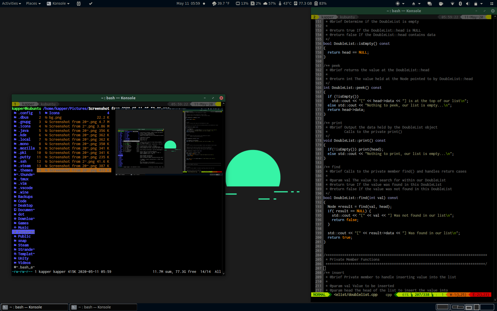

# dots

A place for backing up my dotfiles. Be sure to clone recursively if you want to grab updated plugins / submodules included. For example, using Pathogen with Vim to manage plugins requires that the plugin to be installed are cloned to the `~/.vim/bundle/` directory. Cloning recursively allows git to clone these same nested repositories/submodules within this directory so Pathogen can handle running the Vim plugins.

It is recommended for the most simple setup to use the `headless` branch, as it is very lightly modified and intended to only change terminal configurations for various packages. Everything there should work out of the box following the README instructions, whereas a more custom branch like this one may require some tweaking to fit your local system modifications.

These configs were created and tested on Lubuntu using i3-gaps, and should only be used on similar systems. This is intentionally a very light configuration created for a Toshiba 2 Chromebook running an Intel Dual Core N2840 2.16GHz with 2GB of RAM. I find it to be very usable as a daily driver when booting from a persistent USB created with [Universal USB Installer](https://www.pendrivelinux.com/universal-usb-installer-easy-as-1-2-3/), after booting you can expect to be using ~300MB of RAM. This leaves plenty of RAM available to browse the web, run IDEs and view PDFs or work on other documents in LibreOffice.

Media keys work for backlight, volume, and yakuake drop-down toggle. Alt is mod key within i3-gaps

Easiest installation is to clone repository into home directory - 

```bash
git clone -b master --recursive https://github.com/shaunrd0/dot ~/dot
cd ~/dot/
stow .
```

If you'd rather clone elsewhere - 

```bash
git clone -b master --recursive https://github.com/shaunrd0/dot /path/to/dot
cd /path/to/dot/
stow -t ~ .
```

I use the `libclang-10-dev` package for clang completion. You can use whichever version you want, but be sure to set your path accordingly. To use the same version as I do, run `sudo apt install libclang-10-dev`

In all cases, you will need to run the two commands below or otherwise set the path to `libclang.so.1` on your system.

```
echo "export LIBCLANG=\""$(sudo find / -name libclang.so.1)"\"" >> ~/.bash_aliases
echo "let g:clang_library_path=$LIBCLANG" >> ~/.vimrc
```

Note that the `dot/packages/` directory is for reference and is the only directory included not meant to be used with stow. If this directory is stowed there will be no real change to the system - you will still need to install the package lists manually.

`stow --adopt .` can be used to install conflicting files, but doing so will result in the loss of your local configurations. If you want to keep them, back up the conflicting files output in the error message before running this command.




