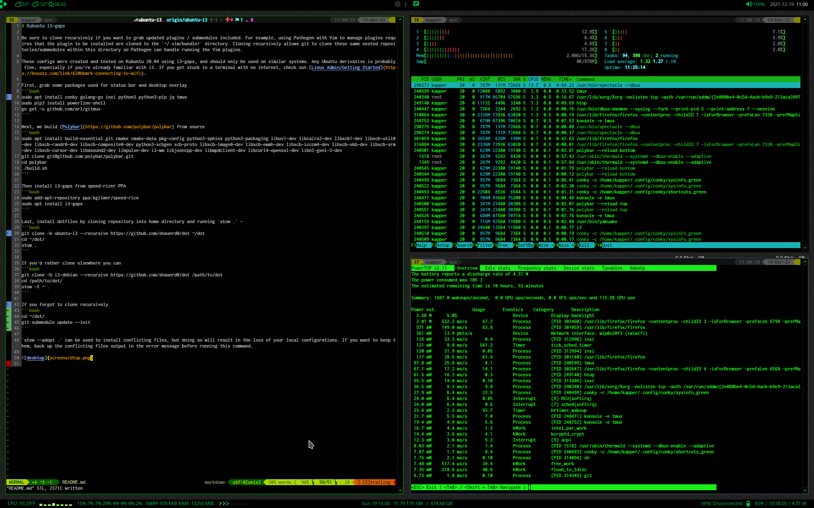

# Kubuntu i3-gaps

Be sure to clone recursively if you want to grab updated plugins / submodules included. For example, using Pathogen with Vim to manage plugins requires that the plugin to be installed are cloned to the `~/.vim/bundle/` directory. Cloning recursively allows git to clone these same nested repositories/submodules within this directory so Pathogen can handle running the Vim plugins.

These configs were created and tested on Kubuntu 20.04 using i3-gaps, and should only be used on similar systems. Any Ubuntu derivative is probably fine, especially if you're already familiar with i3. If you get stuck in a terminal with no internet, check out [Linux Admin/Getting Started](https://knoats.com/link/62#bkmrk-connecting-to-wifi). 

#### Install Dependencies and Dotfiles

First, grab some packages used for status bar and desktop overlay
```bash
sudo apt install conky golang-go inxi python3 python3-pip jq tmux xbindkeys xautolock pulsemixer
sudo pip3 install powerline-shell
go get -u github.com/arl/gitmux
```

Next, we build [Polybar](https://github.com/polybar/polybar) from source
```bash
sudo apt install build-essential git cmake cmake-data pkg-config python3-sphinx python3-packaging libuv1-dev libcairo2-dev libxcb1-dev libxcb-util0-dev libxcb-randr0-dev libxcb-composite0-dev python3-xcbgen xcb-proto libxcb-image0-dev libxcb-ewmh-dev libxcb-icccm4-dev libxcb-xkb-dev libxcb-xrm-dev libxcb-cursor-dev libasound2-dev libpulse-dev i3-wm libjsoncpp-dev libmpdclient-dev libcurl4-openssl-dev libnl-genl-3-dev
git clone git@github.com:polybar/polybar.git
cd polybar
./build.sh
```

Build [Brightnessctl](https://github.com/Hummer12007/brightnessctl) from source and configure your user permissions for brightness control
```bash
git clone https://github.com/Hummer12007/brightnessctl
cd brightnessctl
sudo ./configure && sudo make install
sudo usermod -aG video <YOUR_USERNAME>
```

Then install i3-gaps from speed-ricer PPA 
```bash
sudo add-apt-repository ppa:kgilmer/speed-ricer
sudo apt install i3-gaps
```

Last, install these dotfiles to configure all of these applications by cloning repository into home directory and running `stow .` - 
```bash
git clone -b kubuntu-i3 --recursive https://github.com/shaunrd0/dot ~/dot
cd ~/dot/
stow .
```

If you'd rather clone elsewhere you can
```bash
git clone -b kubuntu-i3 --recursive https://github.com/shaunrd0/dot /path/to/dot
cd /path/to/dot/
stow -t ~ .
```

If you forgot to clone recursively
```bash
cd ~/dot/
git submodule update --init
```



#### Additional Configuration

`stow --adopt .` can be used to install conflicting files, but doing so will result in the loss of your local configurations. If you want to keep them, back up the conflicting files output in the error message before running this command.


**Installation of clang for clang completion**

If you don't want clang completion, just remove the plugin directory from `~/.vim/bundle/`.

If you don't remove clang completion and skip the following steps, vim will show errors when   opening source code files. This is because these configurations use clang completion for so  urce code auto completion and drop-down menus within vim.

Note that the `printf` command may take some time to finish, since it is searching your syst  em for a needed file.

```bash
sudo apt install clang
printf "export LIBCLANG=\""$(find /usr/ -name libclang.so.1 2>/dev/null)"\"\n\n" >> .bash_al  iases
echo "let g:clang_library_path=\$LIBCLANG" >> ~/.vimrc
source ~/.bashrc
```


**To configure tap to click on laptop touchpads**, run the following commands
```bash
sudo mkdir /etc/X11/xorg.conf.d
sudoedit /etc/X11/xorg.conf.d/90-touchpad.conf
```

And input the following lines into the `90-touchpad.conf` file. Save, exit, then run `sudo pkill -KILL -u <YOUR_USERNAME>` to logout of your user and log back in to apply the changes.
```
Section "InputClass"
  Identifier "touchpad"
  MatchIsTouchpad "on"
  Driver "libinput"
  Option "Tapping" "on"
EndSection
```

**Optionally, you can also modify the following keybinds in `.xbindkeysrc`.** I wrote some addiitonal comments in the file and also you can check out [Linux Admin/i3](https://knoats.com/books/linux-admin/page/i3#bkmrk-xkeybinds) for more help if needed.
```
# SETUP INSTRUCTIONS:
# Run `xbindkeys --key` and press a key to get the output
# Place the output under the correspondng action to trigger for that key press
# Useful for configuring media keys for laptops; They all differ
# These settings are for a Dell XPS 13 9310

#Volume Up
"pactl set-sink-volume @DEFAULT_SINK@ +10%"
  m:0x0 + c:123
  XF86AudioRaiseVolume

#Volume Down
"pactl set-sink-volume @DEFAULT_SINK@ -10%"
  m:0x0 + c:122
  XF86AudioLowerVolume

#Toggle Audio
"pactl set-sink-mute @DEFAULT_SINK@ toggle"
  m:0x0 + c:121
  XF86AudioMute

#Brightness Up
"brightnessctl s +2.5%"
  m:0x0 + c:233
  XF86MonBrightnessUp

#Brightness Down
"brightnessctl s 2.5%-"
  m:0x0 + c:232
  XF86MonBrightnessDown
```

