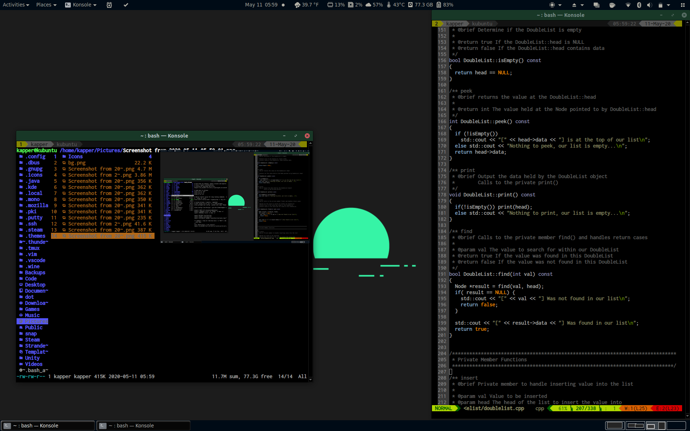

# dots

A place for backing up my dotfiles. Be sure to clone recursively if you want to grab updated plugins / submodules included. For example, using Pathogen with Vim to manage plugins requires that the plugin to be installed are cloned to the `~/.vim/bundle/` directory. Cloning recursively allows git to clone these same nested repositories/submodules within this directory so Pathogen can handle running the Vim plugins.

These configs were created and tested on default Ubuntu 20.04, and should only be used on similar systems. Easiest installation is to clone repository into home directory - 

```bash
git clone -b focal-debian --recursive https://github.com/shaunrd0/dot ~/dot
cd ~/dot/
stow .
```

If you'd rather clone elsewhere - 

```bash
git clone -b focal-debian --recursive https://github.com/shaunrd0/dot /path/to/dot
cd /path/to/dot/
stow -t ~ .
```

I use the `libclang-10-dev` package for clang completion. You can use whichever version you want, but be sure to set your path accordingly. To use the same version as I do, run `sudo apt install libclang-10-dev`

In all cases, you will need to run the two commands below or otherwise set the path to `libclang.so.1` on your system.

```
echo "export LIBCLANG=\""$(sudo find / -name libclang.so.1)"\"" >> ~/.bash_aliases
echo "let g:clang_library_path=$LIBCLANG" >> ~/.vimrc
```

Note that the `dot/packages/` directory is for reference and is the only directory included not meant to be used with stow. If this directory is stowed there will be no real change to the system - you will still need to install the package lists manually. I have started work on automating the restore and backup process but it is not quite finished and not recommended for use at this time.

`stow --adopt .` can be used to install conflicting files, but doing so will result in the loss of your local configurations. If you want to keep them, back up the conflicting files output in the error message before running this command.




